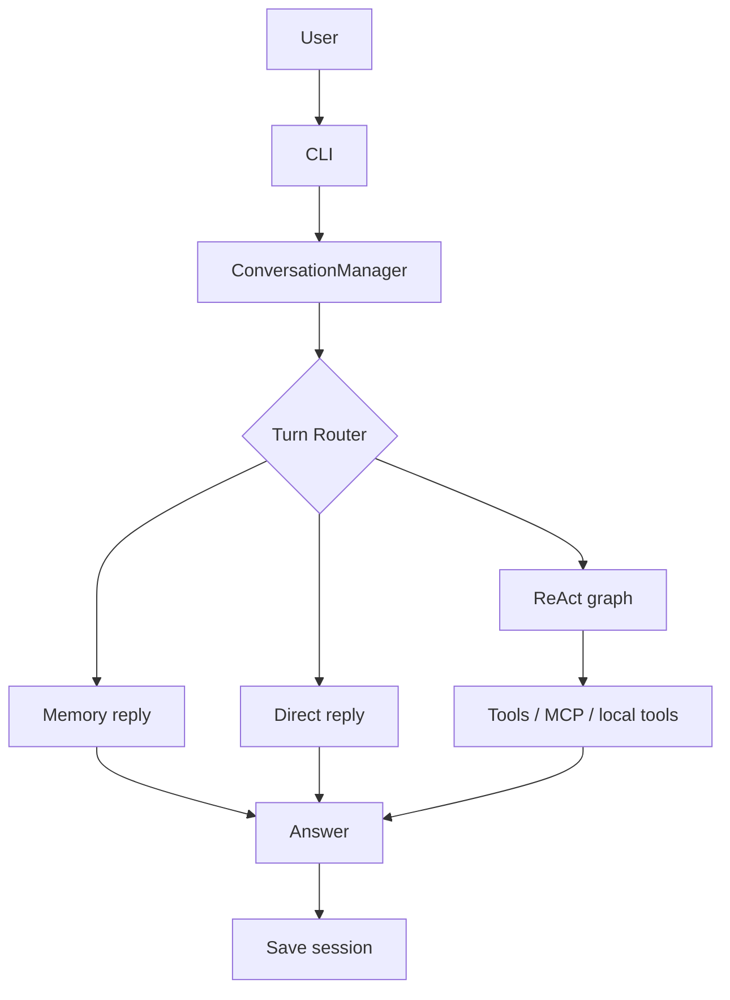
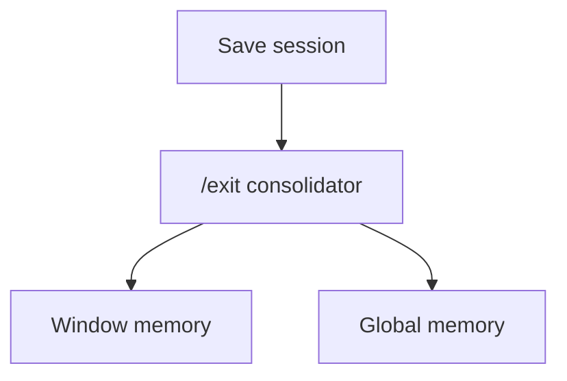
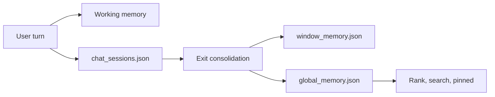

# micro-agent Architecture Guide

This guide explains the project structure, turn flow, memory model, RAG logic, and terminal commands.

## High-Level View





## Main Entry Points

- `python -m coder` starts the interactive CLI
- `coder/cli/app.py` handles commands and exit-time memory jobs
- `core/product/conversation/manager.py` orchestrates one user turn
- `core/agent.py` runs the ReAct graph
- `freeweb/` is an optional submodule for local web tooling; use `git submodule update --init --recursive` after cloning if it is absent

## Technology Stack

### Python Runtime

Most of the project is Python:

- `coder/` provides the terminal application
- `core/` provides the agent runtime, tool registry, memory stores, RAG, prompt builders, and MCP client/server code
- `examples/` contains demos and trace scripts

The current Python dependencies in `requirements.txt` are:

- `langgraph>=0.2.0`
- `pypdf>=6.0.0`
- `openpyxl>=3.1.0`

`pypdf` and `openpyxl` are used by local RAG document readers for PDF and Excel files.

### LLM Client

Code: `core/llm_client.py`

- Reads `.env`
- Uses a DeepSeek-compatible chat-completions API
- Exposes a simple `chat(messages, temperature=...)` interface
- Is used by routers, direct answers, ReAct nodes, compression, and memory consolidation

### LangGraph

Code: `core/agent.py`, `langgraph/graph.py`

The agent is written in the LangGraph mental model: a state object moves through named nodes and conditional edges. The repository also contains a small local `langgraph/` compatibility implementation with `StateGraph`, `START`, and `END`, so the ReAct control flow remains easy to inspect.

The ReAct graph uses these nodes:

- `think`
- `act`
- `reflect`
- `repair`
- `stop`

### LangChain Compatibility

Code: `langchain_core/messages.py`

This repo does not depend on the full LangChain stack for the main runtime. It includes a tiny local `langchain_core` message shim with `HumanMessage` and `SystemMessage` so examples and experiments can use familiar LangChain-style message objects without pulling in a larger dependency surface.

### MCP

Code: `core/protocols/mcp/client.py`, `core/protocols/mcp/server.py`

The project uses a JSON-line MCP-style protocol to load external tools into the same `ToolRegistry` abstraction as local tools.

- `MCPClientSession` starts a subprocess
- The client sends `initialize`, `tools/list`, and `tools/call`
- Each remote tool is wrapped as an `MCPTool`
- Providers decide which MCP server to start

Current providers:

- `AmapCapabilityProvider` starts `python -m coder mcp-server amap`
- `FreeWebProvider` starts `freeweb/dist/index.js` if built, otherwise `npx -y freeweb-mcp@latest`

## One Turn, End to End

1. The CLI forwards user input to `ConversationManager.ask()`.
2. The manager picks or creates a namespace.
3. A `ReActAgent` is attached to the session and its working memory is synced.
4. Long-term memory is searched for pinned and relevant candidates.
5. `TurnRouter` decides whether the turn is `memory`, `direct`, or `react`.
6. `RAGRouter` decides whether local knowledge should be injected.
7. `ContextBuilder` assembles the final prompt bundle.
8. Direct turns use the normal reply path; React turns use LangGraph; memory turns use a short acknowledgment style.
9. The Q/A pair is written back to `data/chat_sessions.json`.
10. On `/exit`, the current window is summarized and merged into `window_memory.json` and `global_memory.json`.

## Memory Layers

### Working Memory

Code: `core/memory.py`

- Holds small, short-lived facts for the current session
- Uses `extract_key_facts()` to pull stable facts from user text
- Exists only in memory; it is not directly persisted
- `WorkingMemory.snapshot()` exposes the current set to the agent and prompt builder

### Session History

Code: `data/chat_sessions.json`

- Stores the full conversation per namespace
- Restores the current chat window
- `/del` removes session history only; it does not touch long-term memory

### Window Memory

Code: `data/window_memory.json`

- Created when a chat window is exited
- Stores a summary plus the cleaned memory candidates from that window
- Preserves "what happened in this window" for later recall

### Global Memory

Code: `data/global_memory.json`

- Shared across namespaces
- Tracks `active`, `stale`, `archived`, and `deleted` states
- Uses `memory_key` for slot-like records such as name, preference, and reply style
- `pinned()` returns high-value stable facts first



## RAG Logic

Code: `core/rag.py` and `core/memory_pipeline.py`

- Reads `.md`, `.txt`, `.csv`, `.tsv`, `.docx`, `.pdf`, and `.xlsx` files from `knowledge_base/`
- Splits documents into chunks and runs lightweight lexical retrieval
- `RAGRouter` first asks the model whether RAG is needed
- If needed, the best chunks are inserted into the prompt as context blocks
- `QdrantKnowledgeBase` is included for optional vector retrieval experiments

## Agent Logic

Code: `core/agent.py`

The ReAct agent is a LangGraph:

```text
START -> think -> act -> reflect -> think
                 \-> repair -> think
                 \-> stop -> END
```

- `think`: call the model and parse `Action[...]` or `Finish[...]`
- `act`: run the tool and append an Observation
- `reflect`: ask the model whether to continue, repair, or finish
- `repair`: ask the model to fix the output format
- `stop`: exit safely when the step limit is reached

Tool call logs are written to `examples/tool_call_log.jsonl`. ReAct traces are written to `examples/react_trace_log.jsonl`.

## Tool System

Code: `core/tools.py`, `core/providers/`, `core/protocols/mcp/`

All tools share the same interface:

- `Tool.name`
- `Tool.description`
- `Tool.get_parameters()`
- `Tool.run(parameters)`

`ToolRegistry` handles registration, lookup, prompt descriptions, and OpenAI-style schema export.

### Local Tools

Local tools are always available when the default registry is created:

| Tool | Source | Purpose |
| --- | --- | --- |
| `Calculator` | `core/tools.py` | Safe arithmetic using Python AST parsing |
| `Now` | `core/tools.py` | Current local date and time |

The code also contains local Amap-backed tool classes (`WeatherTool`, `StaticMapTool`, `NearbySearchTool`), but the current default path loads Amap through MCP providers.

### Amap MCP Tools

Provider: `core/providers/amap.py`

Server: `python -m coder mcp-server amap`

| Tool | Purpose |
| --- | --- |
| `Weather` | Current weather and short forecast |
| `Geocode` | Address to coordinate |
| `Regeocode` | Coordinate to formatted address |
| `StaticMap` | Static map URL |
| `NearbySearch` | Nearby POI search |
| `InputTips` | Keyword suggestion |
| `Route` | Walking, driving, or transit planning |
| `Bus` | Bus line search |

Required environment:

- `GAODE_API_KEY`
- Optional endpoint overrides such as `GAODE_WEATHER_URL`, `GAODE_GEOCODE_URL`, and related Amap URLs

### FreeWeb MCP Tools

Provider: `core/providers/freeweb.py`

Runtime:

- Prefer local built submodule: `node freeweb/dist/index.js`
- Fallback: `npx -y freeweb-mcp@latest`

Common tools:

| Tool | Purpose |
| --- | --- |
| `web_search` | Public web search |
| `search_and_browse` | Search then browse top hits |
| `browse_page` | Extract readable content from a URL |
| `smart_browse` | Browser-aware browsing for dynamic pages |
| `deep_search` | Search across sources such as GitHub, npm, and MDN |
| `github_search` | Search GitHub repos, code, or issues |
| `github_repo_files` | List GitHub repository files |
| `parallel_browse` | Browse several URLs in parallel |
| `get_page_links` | Extract links from a page |
| `screenshot` | Capture a page screenshot |
| `inspect_llms_txt` | Inspect `llms.txt` guidance |

The conversation layer can bias a turn toward web tools with `/net on` or `/net once`.

## Module Layout

### `coder/`

```text
coder/
├── __main__.py
└── cli/
    ├── __init__.py
    ├── app.py
    ├── commands.py
    └── memory_worker.py
```

- CLI entry point, command parsing, and background memory worker
- `coder/cli/app.py` is the interactive entry

### `core/`

```text
core/
├── __init__.py
├── agent.py
├── compression.py
├── conversation.py
├── context_builder.py
├── framework.py
├── llm_client.py
├── long_term_memory.py
├── memory.py
├── memory_pipeline.py
├── prompts.py
├── rag.py
├── skills.py
├── task_pipeline.py
├── tools.py
├── window_memory.py
├── providers/
│   ├── __init__.py
│   ├── amap.py
│   ├── base.py
│   └── freeweb.py
├── protocols/
│   ├── __init__.py
│   └── mcp/
│       ├── __init__.py
│       ├── client.py
│       └── server.py
└── product/
    ├── __init__.py
    ├── agents/
    │   ├── __init__.py
    │   └── react_agent.py
    ├── conversation/
    │   ├── __init__.py
    │   └── manager.py
    ├── memory/
    │   ├── __init__.py
    │   ├── long_term.py
    │   ├── pipeline.py
    │   └── working.py
    ├── prompts/
    │   ├── __init__.py
    │   └── templates.py
    ├── rag/
    │   ├── __init__.py
    │   └── knowledge_base.py
    ├── skills/
    │   └── __init__.py
    └── tools/
        ├── __init__.py
        └── catalog.py
```

- `core/` is the low-level runtime and compatibility layer
- `core/product/` is the more product-facing wrapper layer
- `core/providers/` packages external capabilities into providers
- `core/protocols/mcp/` implements the JSON-line MCP client/server

### `skills/`

```text
skills/
├── engineering-exploration/
│   ├── SKILL.md
│   ├── agents/
│   │   └── openai.yaml
│   └── references/
│       ├── capability-design.md
│       ├── engineering-design-dimensions.md
│       ├── exploration-boundaries.md
│       └── platform-portability.md
└── engineering-exploration-skill/
    ├── README.md
    └── engineering-exploration.zip
```

- `skills/engineering-exploration/` is the skill runtime actually loads
- `skills/engineering-exploration-skill/` keeps the downloaded source bundle for traceability

### `scripts/`

```text
scripts/
└── skill_smoke_test.py
```

- Offline validation for explicit and implicit skill activation

### `examples/`

```text
examples/
├── debug_freeweb_mcp.py
├── main.py
├── memory_playground.py
├── qdrant_rag_demo.py
├── rag_demo.py
├── trace_run.py
├── trace_three_step_qa.py
└── working_memory_demo.py
```

- Demos, debug scripts, and trace samples

### `knowledge_base/`

```text
knowledge_base/
├── chapter8_learning_path.md
├── project_notes.md
├── rag_basics.md
└── rag_table_notes.csv
```

- Local RAG corpus

### `freeweb/`

```text
freeweb/
├── src/
├── tests/
├── README.md
├── AGENTS.md
├── CHANGELOG.md
└── package.json
```

- Optional web tooling submodule used by the FreeWeb provider

### `langchain_core/`

```text
langchain_core/
├── __init__.py
└── messages.py
```

- Lightweight LangChain message compatibility layer

### `langgraph/`

```text
langgraph/
├── __init__.py
├── graph.py
└── checkpoint/
    ├── __init__.py
    └── memory.py
```

- Local LangGraph-style compatibility implementation

### `data/`

```text
data/
└── (runtime generated)
```

- Runtime session, window memory, and global memory state

## Terminal Commands

### Chat Commands

- `/new` - mark the next turn as a new session
- `/compress` - compress the current chat history and log the evaluation
- `/del <namespace>` - delete a specific chat history
- `/tools` - print tool descriptions
- `/net on|once|off|status` - control network preference
- `/exit` - consolidate the current window and quit
- `/exit -n` - consolidate the current window and stay in the CLI

### Background Commands

- `python -m coder memory-worker <job.json>` - run a memory consolidation job
- `python -m coder mcp-server amap` - serve Amap MCP tools
- `python -m coder mcp-server weather` - serve weather MCP tools
- `git submodule update --init --recursive` - fetch the optional `freeweb/` web tooling submodule

## Recommended Reading Order

1. `coder/cli/app.py`
2. `core/product/conversation/manager.py`
3. `core/memory_pipeline.py`
4. `core/agent.py`
5. `core/long_term_memory.py`
6. `core/rag.py`
7. `core/tools.py`

## Current Contract

- `.env` is not committed
- `data/` stores runtime state only
- Prefer `core/product/` for high-level imports
- The project name is `micro-agent`
