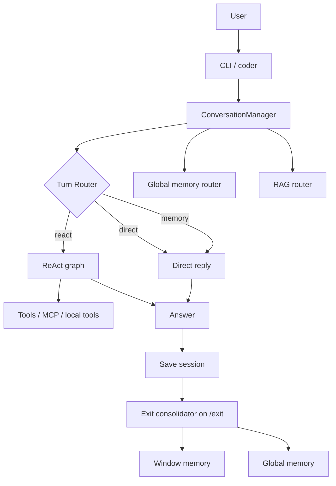
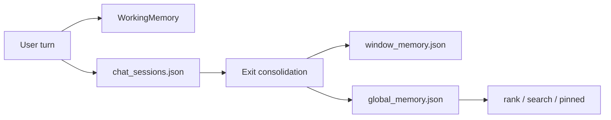

# micro-agent Architecture Guide

This document is written for future Codex runs and maintainers. It explains the project structure, turn flow, memory model, RAG logic, and terminal commands.

## High-Level View



## Main Entry Points

- `python -m coder` starts the interactive CLI
- `coder/cli/app.py` handles commands and exit-time memory jobs
- `core/product/conversation/manager.py` orchestrates one user turn
- `core/agent.py` runs the ReAct graph
- `freeweb/` is an optional submodule for local web tooling; use `git submodule update --init --recursive` after cloning if it is absent

## One Turn, End to End

1. The CLI forwards user input to `ConversationManager.ask()`.
2. The manager picks or creates a namespace.
3. A `ReActAgent` is attached to the session and its working memory is synced.
4. Long-term memory is searched for pinned and relevant candidates.
5. `TurnRouter` decides whether the turn is `memory`, `direct`, or `react`.
6. `RAGRouter` decides whether local knowledge should be injected.
7. `ContextBuilder` assembles the final prompt bundle.
8. Direct turns use the normal reply path; React turns use LangGraph; memory turns use a short acknowledgment style.
9. The Q/A pair is written back to `data/chat_sessions.json`.
10. On `/exit`, the current window is summarized and merged into `window_memory.json` and `global_memory.json`.

## Memory Layers

### Working Memory

Code: `core/memory.py`

- Holds small, short-lived facts for the current session
- Uses `extract_key_facts()` to pull stable facts from user text
- Exists only in memory; it is not directly persisted
- `WorkingMemory.snapshot()` exposes the current set to the agent and prompt builder

### Session History

Code: `data/chat_sessions.json`

- Stores the full conversation per namespace
- Restores the current chat window
- `/del` removes session history only; it does not touch long-term memory

### Window Memory

Code: `data/window_memory.json`

- Created when a chat window is exited
- Stores a summary plus the cleaned memory candidates from that window
- Preserves "what happened in this window" for later recall

### Global Memory

Code: `data/global_memory.json`

- Shared across namespaces
- Tracks `active`, `stale`, `archived`, and `deleted` states
- Uses `memory_key` for slot-like records such as name, preference, and reply style
- `pinned()` returns high-value stable facts first



## RAG Logic

Code: `core/rag.py` and `core/memory_pipeline.py`

- Reads `.md`, `.txt`, `.csv`, `.tsv`, `.docx`, `.pdf`, and `.xlsx` files from `knowledge_base/`
- Splits documents into chunks and runs lightweight lexical retrieval
- `RAGRouter` first asks the model whether RAG is needed
- If needed, the best chunks are inserted into the prompt as context blocks
- `QdrantKnowledgeBase` is included for optional vector retrieval experiments

## Agent Logic

Code: `core/agent.py`

The ReAct agent is a LangGraph:

```text
START -> think -> act -> reflect -> think
                 \-> repair -> think
                 \-> stop -> END
```

- `think`: call the model and parse `Action[...]` or `Finish[...]`
- `act`: run the tool and append an Observation
- `reflect`: ask the model whether to continue, repair, or finish
- `repair`: ask the model to fix the output format
- `stop`: exit safely when the step limit is reached

Tool call logs are written to `examples/tool_call_log.jsonl`. ReAct traces are written to `examples/react_trace_log.jsonl`.

## Terminal Commands

### Chat Commands

- `/new` - mark the next turn as a new session
- `/compress` - compress the current chat history and log the evaluation
- `/del <namespace>` - delete a specific chat history
- `/tools` - print tool descriptions
- `/net on|once|off|status` - control network preference
- `/exit` - consolidate the current window and quit
- `/exit -n` - consolidate the current window and stay in the CLI

### Background Commands

- `python -m coder memory-worker <job.json>` - run a memory consolidation job
- `python -m coder mcp-server amap` - serve Amap MCP tools
- `python -m coder mcp-server weather` - serve weather MCP tools
- `git submodule update --init --recursive` - fetch the optional `freeweb/` web tooling submodule

## Recommended Reading Order

1. `coder/cli/app.py`
2. `core/product/conversation/manager.py`
3. `core/memory_pipeline.py`
4. `core/agent.py`
5. `core/long_term_memory.py`
6. `core/rag.py`
7. `core/tools.py`

## Current Contract

- `.env` is not committed
- `data/` stores runtime state only
- Prefer `core/product/` for high-level imports
- The project name is `micro-agent`
