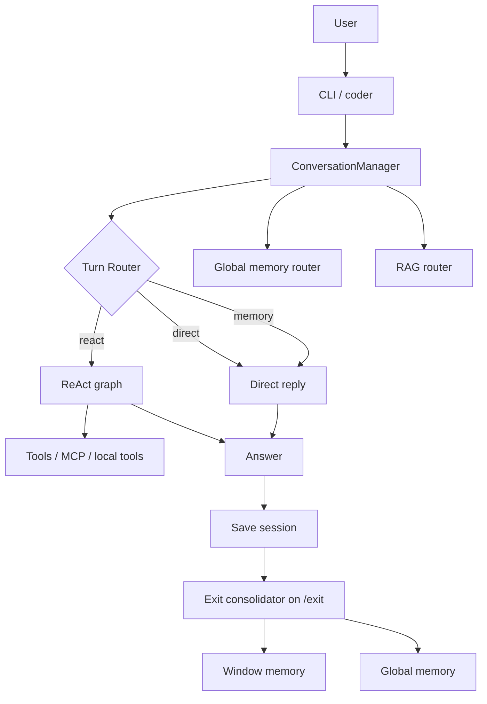
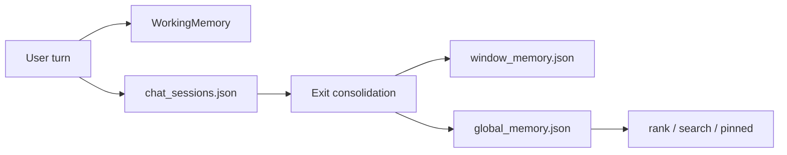

# micro-agent 架构说明

这份文档面向未来的 Codex 和项目维护者，说明项目结构、agent 运行链路、记忆模型、RAG 逻辑、技术栈和终端命令。英文版保留在 [MICRO_AGENT_ARCHITECTURE.en.md](./MICRO_AGENT_ARCHITECTURE.en.md)。

## 总览



## 主要入口

- `python -m coder`：启动交互式 CLI
- `coder/cli/app.py`：处理命令、展示提示、触发退出时记忆任务
- `core/product/conversation/manager.py`：调度一次用户请求
- `core/agent.py`：运行 ReAct 图
- `freeweb/`：可选网页工具子模块；clone 后缺失时运行 `git submodule update --init --recursive`

## 技术栈

### Python Runtime

项目主体是 Python：

- `coder/`：终端应用层
- `core/`：agent runtime、工具注册、记忆存储、RAG、prompt builder、MCP client/server
- `examples/`：演示和轨迹脚本

当前 `requirements.txt` 依赖：

- `langgraph>=0.2.0`
- `pypdf>=6.0.0`
- `openpyxl>=3.1.0`

`pypdf` 和 `openpyxl` 用于本地 RAG 读取 PDF 与 Excel 文件。

### LLM Client

代码位置：`core/llm_client.py`

- 读取 `.env`
- 调用 DeepSeek-compatible chat-completions API
- 暴露 `chat(messages, temperature=...)` 接口
- 被路由、直接回答、ReAct 节点、压缩、记忆整理共同使用

### LangGraph

代码位置：`core/agent.py`、`langgraph/graph.py`

agent 按 LangGraph 的心智模型组织：一个 state 在多个节点和条件边之间流转。仓库中也带有一个轻量 `langgraph/` 兼容实现，提供 `StateGraph`、`START`、`END`，让 ReAct 控制流可以直接阅读。

ReAct 图包含这些节点：

- `think`
- `act`
- `reflect`
- `repair`
- `stop`

### LangChain 兼容层

代码位置：`langchain_core/messages.py`

主运行时不依赖完整 LangChain。项目只提供一个很小的 `langchain_core` message shim，包括 `HumanMessage` 和 `SystemMessage`，方便 examples 和实验代码使用熟悉的 LangChain-style message 对象。

### MCP

代码位置：`core/protocols/mcp/client.py`、`core/protocols/mcp/server.py`

项目使用 JSON-line MCP-style 协议，把外部工具加载进和本地工具相同的 `ToolRegistry` 抽象。

- `MCPClientSession` 启动子进程
- client 发送 `initialize`、`tools/list`、`tools/call`
- 远端工具会包装成 `MCPTool`
- provider 决定启动哪个 MCP server

当前 provider：

- `AmapCapabilityProvider`：启动 `python -m coder mcp-server amap`
- `FreeWebProvider`：优先启动 `freeweb/dist/index.js`，不存在时回退到 `npx -y freeweb-mcp@latest`

## 一轮请求的完整链路

1. CLI 把用户输入交给 `ConversationManager.ask()`
2. manager 选择或创建 namespace
3. 当前 session 绑定 `ReActAgent`，并同步工作记忆
4. 长期记忆检索 pinned 记忆和相关候选记忆
5. `TurnRouter` 判断本轮是 `memory`、`direct` 还是 `react`
6. `RAGRouter` 判断是否需要注入本地知识库
7. `ContextBuilder` 组装最终 prompt bundle
8. `direct` 走普通回答；`react` 走 LangGraph；`memory` 走简短确认式回复
9. 问答写回 `data/chat_sessions.json`
10. `/exit` 时总结当前窗口，并合并进 `window_memory.json` 与 `global_memory.json`

## 记忆分层

### 工作记忆

代码位置：`core/memory.py`

- 保存当前 session 内短期可用的小事实
- 通过 `extract_key_facts()` 从用户文本抽取稳定信息
- 只存在内存中，不直接持久化
- `WorkingMemory.snapshot()` 把当前条目暴露给 agent 和 prompt builder

### 会话历史

代码位置：`data/chat_sessions.json`

- 按 namespace 保存完整对话
- 用于恢复当前聊天窗口
- `/del` 只删除窗口历史，不删除长期记忆

### 窗口记忆

代码位置：`data/window_memory.json`

- 退出聊天窗口时生成
- 保存窗口摘要和清洗后的记忆候选
- 用来保留“这个窗口发生过什么”

### 全局记忆

代码位置：`data/global_memory.json`

- 跨 namespace 共享
- 跟踪 `active`、`stale`、`archived`、`deleted` 状态
- 使用 `memory_key` 管理槽位型记录，例如姓名、偏好、回复风格
- `pinned()` 优先返回高价值稳定事实



## RAG 逻辑

代码位置：`core/rag.py`、`core/memory_pipeline.py`

- 从 `knowledge_base/` 读取 `.md`、`.txt`、`.csv`、`.tsv`、`.docx`、`.pdf`、`.xlsx`
- 先切分文档 chunk，再做轻量词项检索
- `RAGRouter` 先询问模型本轮是否需要 RAG
- 如果需要，把最佳 chunk 作为上下文块插入 prompt
- `QdrantKnowledgeBase` 用于可选向量检索实验

## Agent 运行逻辑

代码位置：`core/agent.py`

ReAct agent 是一个 LangGraph-style 图：

```text
START -> think -> act -> reflect -> think
                 \-> repair -> think
                 \-> stop -> END
```

- `think`：调用模型并解析 `Action[...]` 或 `Finish[...]`
- `act`：执行工具并追加 Observation
- `reflect`：让模型判断继续、修复还是结束
- `repair`：要求模型修正输出格式
- `stop`：达到步数上限时安全退出

工具调用日志写入 `examples/tool_call_log.jsonl`，ReAct 轨迹写入 `examples/react_trace_log.jsonl`。

## 工具体系

代码位置：`core/tools.py`、`core/providers/`、`core/protocols/mcp/`

所有工具共享同一个接口：

- `Tool.name`
- `Tool.description`
- `Tool.get_parameters()`
- `Tool.run(parameters)`

`ToolRegistry` 负责注册、查找、生成 prompt 描述和导出 OpenAI-style schema。

### 本地工具

创建默认 registry 时，本地工具始终可用：

| 工具 | 来源 | 用途 |
| --- | --- | --- |
| `Calculator` | `core/tools.py` | 基于 Python AST 的安全算术计算 |
| `Now` | `core/tools.py` | 获取当前本地日期和时间 |

代码里也保留了 Amap 本地工具类（`WeatherTool`、`StaticMapTool`、`NearbySearchTool`），但当前默认路径通过 MCP provider 加载 Amap。

### Amap MCP 工具

Provider：`core/providers/amap.py`

Server：`python -m coder mcp-server amap`

| 工具 | 用途 |
| --- | --- |
| `Weather` | 当前天气和短期预报 |
| `Geocode` | 地址转坐标 |
| `Regeocode` | 坐标转格式化地址 |
| `StaticMap` | 生成静态地图 URL |
| `NearbySearch` | 周边 POI 搜索 |
| `InputTips` | 关键词输入提示 |
| `Route` | 步行、驾车、公交路线规划 |
| `Bus` | 公交线路查询 |

需要的环境变量：

- `GAODE_API_KEY`
- 可选 endpoint 覆盖，例如 `GAODE_WEATHER_URL`、`GAODE_GEOCODE_URL` 等 Amap URL

### FreeWeb MCP 工具

Provider：`core/providers/freeweb.py`

运行方式：

- 优先使用本地已构建子模块：`node freeweb/dist/index.js`
- 回退方式：`npx -y freeweb-mcp@latest`

常用工具：

| 工具 | 用途 |
| --- | --- |
| `web_search` | 公共网页搜索 |
| `search_and_browse` | 搜索并浏览最佳结果 |
| `browse_page` | 从 URL 提取可读内容 |
| `smart_browse` | 面向动态页面的浏览 |
| `deep_search` | 跨 GitHub、npm、MDN 等来源搜索 |
| `github_search` | 搜索 GitHub 仓库、代码或 issue |
| `github_repo_files` | 列出 GitHub 仓库文件 |
| `parallel_browse` | 并行浏览多个 URL |
| `get_page_links` | 提取页面链接 |
| `screenshot` | 页面截图 |
| `inspect_llms_txt` | 检查 `llms.txt` 指引 |

对话层可以用 `/net on` 或 `/net once` 偏向网页工具。

## 终端命令

### 对话命令

- `/new`：标记下一轮为新 session
- `/compress`：压缩当前聊天历史并记录评估
- `/del <namespace>`：删除指定聊天历史
- `/tools`：打印工具描述
- `/net on|once|off|status`：控制网络偏好
- `/exit`：整理当前窗口并退出
- `/exit -n`：整理当前窗口并继续留在 CLI

### 后台命令

- `python -m coder memory-worker <job.json>`：执行记忆整理任务
- `python -m coder mcp-server amap`：启动 Amap MCP 工具
- `python -m coder mcp-server weather`：启动 Weather-only MCP 工具
- `git submodule update --init --recursive`：拉取可选 `freeweb/` 工具子模块

## 推荐阅读顺序

1. `coder/cli/app.py`
2. `core/product/conversation/manager.py`
3. `core/memory_pipeline.py`
4. `core/agent.py`
5. `core/long_term_memory.py`
6. `core/rag.py`
7. `core/tools.py`

## 当前约定

- `.env` 不提交
- `data/` 只保存运行时状态
- 高层导入优先使用 `core/product/`
- 项目名统一为 `micro-agent`
