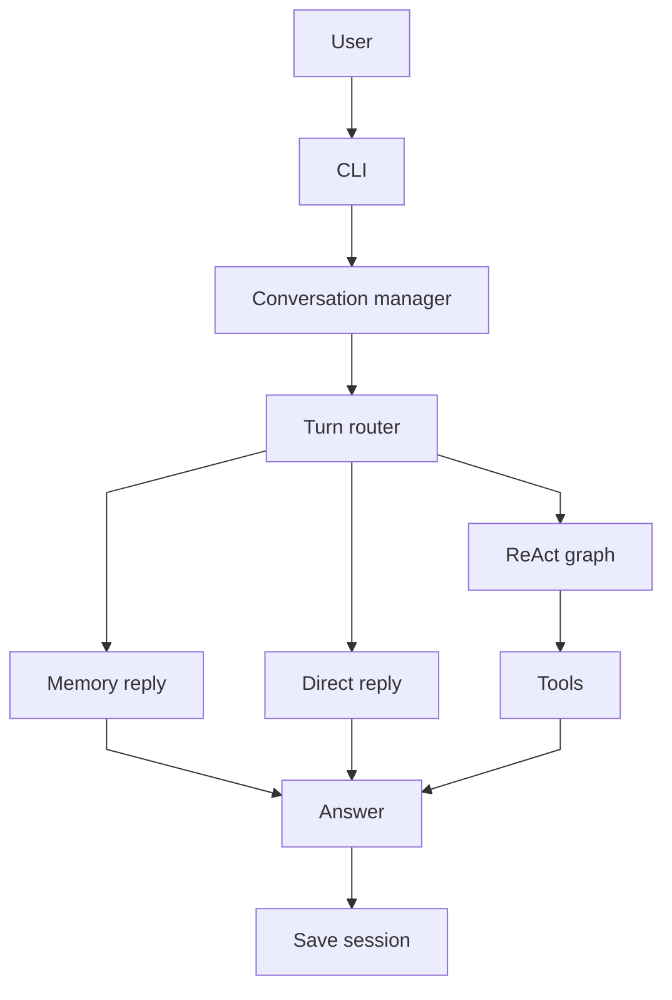
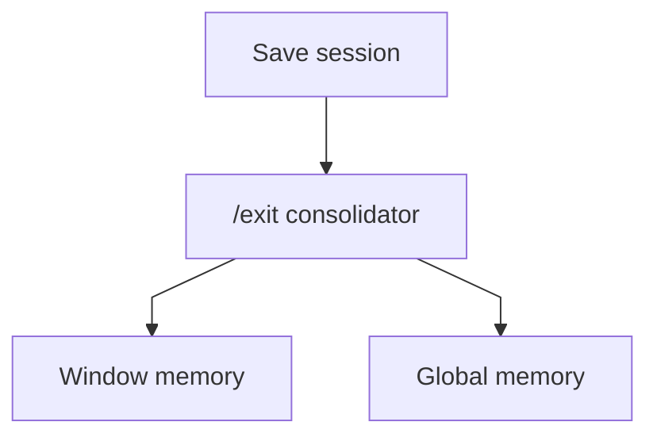
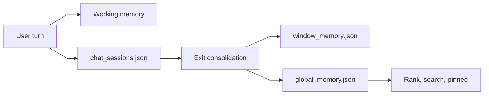

# micro-agent 架构说明

这份文档说明项目结构、agent 运行链路、记忆模型、RAG 逻辑、技术栈和终端命令。英文版保留在 [MICRO_AGENT_ARCHITECTURE.en.md](./MICRO_AGENT_ARCHITECTURE.en.md)。

## 总览





## 主要入口

- `python -m src.coder`：启动交互式 CLI
- `src/coder/cli/app.py`：处理命令、展示提示、触发退出时记忆任务
- `src/core/product/conversation/manager.py`：调度一次用户请求
- `src/core/agent.py`：运行 ReAct 图
- `tools/mcp_servers/freeweb/`：可选网页工具子模块；clone 后缺失时运行 `git submodule update --init --recursive`

## 技术栈

### Python Runtime

项目主体是 Python：

- `src/coder/`：终端应用层
- `src/core/`：agent runtime、工具注册、记忆存储、RAG、prompt builder、MCP client/server
- `examples/`：演示和轨迹脚本

当前 `requirements.txt` 依赖：

- `langgraph>=0.2.0`
- `markitdown[all]`
- `openpyxl`

`markitdown` 用于本地 RAG 解析多种文档格式（PDF, Excel, Docx等）。

### LLM Client

代码位置：`src/core/llm_client.py`

- 读取 `.env`
- 调用 DeepSeek-compatible chat-completions API
- 暴露 `chat(messages, temperature=...)` 接口
- 被路由、直接回答、ReAct 节点、压缩、记忆整理共同使用
- **新增 `MemoryLLMClient`**：专为高频和长文本上下文（如窗口压缩 `/compress` 和退出时的会话归纳 `/exit`）设计。允许通过 `MEMORY_LLM_*` 配置廉价小模型（如 Qwen 系列），从而大幅降低后台记忆整理任务的 Token 成本。

### LangGraph

代码位置：`src/core/agent.py`、`src/langgraph/graph.py`

agent 按 LangGraph 的心智模型组织：一个 state 在多个节点和条件边之间流转。仓库中也带有一个轻量 `src/langgraph/` 兼容实现，提供 `StateGraph`、`START`、`END`，让 ReAct 控制流可以直接阅读。

ReAct 图包含这些节点：

- `think`
- `act`
- `reflect`
- `repair`
- `stop`

### LangChain 兼容层

代码位置：`src/langchain_core/messages.py`

主运行时不依赖完整 LangChain。项目只提供一个很小的 `langchain_core` message shim，包括 `HumanMessage` 和 `SystemMessage`，方便 examples 和实验代码使用熟悉的 LangChain-style message 对象。

### MCP

代码位置：`src/core/protocols/mcp/client.py`、`src/core/protocols/mcp/server.py`

项目使用 JSON-line MCP-style 协议，把外部工具加载进和本地工具相同的 `ToolRegistry` 抽象。

- `MCPClientSession` 启动子进程
- client 发送 `initialize`、`tools/list`、`tools/call`
- 远端工具会包装成 `MCPTool`
- provider 决定启动哪个 MCP server
- 新增：支持直接解析 `tools/mcp_servers/mcp.json` 动态加载任意标准 MCP Server（例如文件系统、Everything 搜索等）。

当前 provider：

- `AmapCapabilityProvider`：启动 `python -m src.coder mcp-server amap`
- `FreeWebProvider`：优先启动 `tools/mcp_servers/freeweb/dist/index.js`，不存在时回退到 `npx -y freeweb-mcp@latest`

## 一轮请求的完整链路

1. CLI 把用户输入交给 `ConversationManager.ask()`
2. manager 选择或创建 namespace
3. 当前 session 绑定 `ReActAgent`，并同步工作记忆
4. 通过 `universal-location-and-transit-assistant` 等 Skill 触发上下文抽取机制，补充并纠正用户可能遗漏的位置或状态信息
5. 长期记忆检索 pinned 记忆和相关候选记忆
6. `TurnRouter` 结合意图与正则表达式判断本轮是 `memory`、`direct` 还是 `react`（文件读写等本地操作均路由至 react 模式）
7. `RAGRouter` 判断是否需要注入本地知识库
8. `ContextBuilder` 组装最终 prompt bundle
9. `direct` 走普通回答；`react` 走 LangGraph 调用工具；`memory` 走简短确认式回复
9. 问答写回 `data/chat_sessions.json`
10. `/exit` 时总结当前窗口，并合并进 `window_memory.json` 与 `global_memory.json`

## 记忆分层

### 工作记忆

代码位置：`src/core/memory.py`

- 保存当前 session 内短期可用的小事实
- 通过 `extract_key_facts()` 从用户文本抽取稳定信息
- 只存在内存中，不直接持久化
- `WorkingMemory.snapshot()` 把当前条目暴露给 agent 和 prompt builder

### 会话历史

代码位置：`data/chat_sessions.json`

- 按 namespace 保存完整对话
- 用于恢复当前聊天窗口
- `/del` 只删除窗口历史，不删除长期记忆

### 窗口记忆

代码位置：`data/window_memory.json`

- 退出聊天窗口时生成（或由后台异步 `memory-worker` 进程生成）
- 保存窗口摘要和清洗后的记忆候选
- 利用专用的 `MemoryLLMClient`（如 Qwen 小模型）进行低成本抽取
- 用来保留“这个窗口发生过什么”

### 全局记忆

代码位置：`data/global_memory.json`

- 跨 namespace 共享
- 跟踪 `active`、`stale`、`archived`、`deleted` 状态
- 使用 `memory_key` 管理槽位型记录，例如姓名、偏好、回复风格
- `pinned()` 优先返回高价值稳定事实



## RAG 逻辑

代码位置：`src/core/rag.py`、`src/core/memory_pipeline.py`

- 从 `data/knowledge_base/` 读取 `.md`、`.txt`、`.csv`、`.tsv`、`.docx`、`.pdf`、`.xlsx`
- 先切分文档 chunk，再做轻量词项检索
- `RAGRouter` 先询问模型本轮是否需要 RAG
- 如果需要，把最佳 chunk 作为上下文块插入 prompt
- `QdrantKnowledgeBase` 用于可选向量检索实验

## Agent 运行逻辑

代码位置：`src/core/agent.py`

ReAct agent 是一个 LangGraph-style 图：

```text
START -> think -> act -> reflect -> think
                 \-> repair -> think
                 \-> stop -> END
```

- `think`：调用模型并解析 `Action[...]` 或 `Finish[...]`
- `act`：执行工具并追加 Observation
- `reflect`：让模型判断继续、修复还是结束
- `repair`：要求模型修正输出格式
- `stop`：达到步数上限时安全退出

工具调用日志写入 `examples/logs/tool_call_log.jsonl`，ReAct 轨迹写入 `examples/logs/react_trace_log.jsonl`。

## 工具体系

代码位置：`src/core/tools.py`、`src/core/providers/`、`src/core/protocols/mcp/`

所有工具共享同一个接口：

- `Tool.name`
- `Tool.description`
- `Tool.get_parameters()`
- `Tool.run(parameters)`

`ToolRegistry` 负责注册、查找、生成 prompt 描述和导出 OpenAI-style schema。

### 本地工具

创建默认 registry 时，本地工具始终可用：

| 工具 | 来源 | 用途 |
| --- | --- | --- |
| `Calculator` | `src/core/tools.py` | 基于 Python AST 的安全算术计算 |
| `Now` | `src/core/tools.py` | 获取当前本地日期和时间 |

代码里也保留了 Amap 本地工具类（`WeatherTool`、`StaticMapTool`、`NearbySearchTool`），但当前默认路径通过 MCP provider 加载 Amap。

### Amap MCP 工具

Provider：`src/core/providers/amap.py`

Server：`python -m src.coder mcp-server amap`

| 工具 | 用途 |
| --- | --- |
| `Weather` | 当前天气和短期预报 |
| `Geocode` | 地址转坐标 |
| `Regeocode` | 坐标转格式化地址 |
| `StaticMap` | 生成静态地图 URL |
| `NearbySearch` | 周边 POI 搜索 |
| `InputTips` | 关键词输入提示 |
| `Route` | 步行、驾车、公交路线规划 |
| `Bus` | 公交线路查询 |

需要的环境变量：

- `GAODE_API_KEY`
- 可选 endpoint 覆盖，例如 `GAODE_WEATHER_URL`、`GAODE_GEOCODE_URL` 等 Amap URL

### FreeWeb MCP 工具

Provider：`src/core/providers/freeweb.py`

运行方式：

- 优先使用本地已构建子模块：`node tools/mcp_servers/freeweb/dist/index.js`
- 回退方式：`npx -y freeweb-mcp@latest`

常用工具：

| 工具 | 用途 |
| --- | --- |
| `web_search` | 公共网页搜索 |
| `search_and_browse` | 搜索并浏览最佳结果 |
| `browse_page` | 从 URL 提取可读内容 |
| `smart_browse` | 面向动态页面的浏览 |
| `deep_search` | 跨 GitHub、npm、MDN 等来源搜索 |
| `github_search` | 搜索 GitHub 仓库、代码或 issue |
| `github_repo_files` | 列出 GitHub 仓库文件 |
| `parallel_browse` | 并行浏览多个 URL |
| `get_page_links` | 提取页面链接 |
| `screenshot` | 页面截图 |
| `inspect_llms_txt` | 检查 `llms.txt` 指引 |

对话层可以用 `/net on` 或 `/net once` 偏向网页工具。

## 模块目录

### `src/coder/`

```text
src/coder/
├── __main__.py
└── cli/
    ├── __init__.py
    ├── app.py
    ├── commands.py
    └── memory_worker.py
```

- CLI 入口、命令解析、后台记忆 worker
- `src/coder/cli/app.py` 是交互式入口

### `src/core/`

```text
src/core/
├── __init__.py
├── agent.py
├── compression.py
├── conversation.py
├── context_builder.py
├── framework.py
├── llm_client.py
├── long_term_memory.py
├── memory.py
├── memory_pipeline.py
├── prompts.py
├── rag.py
├── skills.py
├── task_pipeline.py
├── tools.py
├── window_memory.py
├── providers/
│   ├── __init__.py
│   ├── amap.py
│   ├── base.py
│   └── freeweb.py
├── protocols/
│   ├── __init__.py
│   └── mcp/
│       ├── __init__.py
│       ├── client.py
│       └── server.py
└── product/
    ├── __init__.py
    ├── agents/
    │   ├── __init__.py
    │   └── react_agent.py
    ├── conversation/
    │   ├── __init__.py
    │   └── manager.py
    ├── memory/
    │   ├── __init__.py
    │   ├── long_term.py
    │   ├── pipeline.py
    │   └── working.py
    ├── prompts/
    │   ├── __init__.py
    │   └── templates.py
    ├── rag/
    │   ├── __init__.py
    │   └── knowledge_base.py
    ├── skills/
    │   └── __init__.py
    └── tools/
        ├── __init__.py
        └── catalog.py
```

- `src/core/` 是底层运行时和兼容实现
- `src/core/product/` 是更偏产品层的封装，阅读优先级更高
- `src/core/providers/` 把外部能力包装成 provider
- `src/core/protocols/mcp/` 实现 JSON-line MCP client/server

### `tools/skills/`

```text
tools/skills/
├── engineering-exploration/
│   ├── SKILL.md
│   ├── agents/
│   │   └── openai.yaml
│   └── references/
│       ├── capability-design.md
│       ├── engineering-design-dimensions.md
│       ├── exploration-boundaries.md
│       └── platform-portability.md
└── engineering-exploration-skill/
    ├── README.md
    └── engineering-exploration.zip
```

- `skills/engineering-exploration/` 是 runtime 实际加载的 skill
- `skills/engineering-exploration-skill/` 保留下载来源包，便于追溯

### `scripts/`

```text
scripts/
├── clear_qdrant.py
├── index_kb.py
└── skill_smoke_test.py
```

- 离线验证显性和隐性 skill 触发是否生效
- 知识库索引脚本

### `tests/`

```text
tests/
├── test_everything_agent.py
├── test_freeweb_agent.py
├── test_mcps.py
└── test_ragtool.py
```

- 核心逻辑的 Python 测试用例
- 验证 MCP 工具加载和 Agent 工作流

### `examples/`

```text
examples/
├── logs/
│   ├── react_trace_log.jsonl
│   ├── route_log.jsonl
│   └── tool_call_log.jsonl
├── mcp/
│   └── debug_freeweb_mcp.py
├── memory/
│   ├── memory_playground.py
│   └── working_memory_demo.py
├── rag/
│   ├── generate_rag_dataset.py
│   ├── qdrant_rag_demo.py
│   ├── rag_demo.py
│   ├── rag_evaluator.py
│   └── test_qwen_embedding.py
└── tracing/
    ├── three_step_qa.py
    ├── trace_run.py
    └── trace_three_step_qa.py
```

- 演示、调试脚本和轨迹日志样例

### `data/knowledge_base/`

```text
data/knowledge_base/
├── XX有限公司公司管理制度守则（完整版）.docx
├── rag_table_notes.csv
├── 虚拟SaaS平台技术文档（完整版）.pdf
└── 通用企业全场景FAQ知识库_豆包AI生成.xlsx
```

- 本地 RAG 语料

### `tools/mcp_servers/freeweb/`

```text
tools/mcp_servers/freeweb/
├── src/
├── tests/
├── README.md
├── AGENTS.md
├── CHANGELOG.md
└── package.json
```

- 可选网页工具子模块，供 FreeWeb provider 使用

### `src/langchain_core/`

```text
src/langchain_core/
├── __init__.py
└── messages.py
```

- 轻量 LangChain message 兼容层

### `src/langgraph/`

```text
src/langgraph/
├── __init__.py
├── graph.py
└── checkpoint/
    ├── __init__.py
    └── memory.py
```

- 本地 LangGraph 风格兼容实现

### `data/`

```text
data/
└── (runtime generated)
```

- 运行时生成的会话、窗口记忆和全局记忆

## 终端命令

### 对话命令

- `/new`：标记下一轮为新 session
- `/compress`：压缩当前聊天历史并记录评估
- `/del <namespace>`：删除指定聊天历史
- `/tools`：打印工具描述
- `/rag <strategy>`：设置 RAG 检索策略。可选模式包括：
  - `base`：直接使用用户原始提问进行基础检索
  - `mqe` (Multi-Query Expansion)：多查询扩展，由 LLM 将原问题改写成多个不同视角的查询，再合并检索结果
  - `hyde` (Hypothetical Document Embeddings)：假设性文档嵌入，由 LLM 针对问题先“假想”生成一段回答，利用这段假想回答去向量库中进行更相关的语义匹配
- `/net on|once|off|status`：控制网络偏好
- `/exit`：整理当前窗口并退出
- `/exit -n`：整理当前窗口并继续留在 CLI

### 后台命令

- `python -m src.coder memory-worker <job.json>`：执行记忆整理任务
- `python -m src.coder mcp-server amap`：启动 Amap MCP 工具
- `python -m src.coder mcp-server weather`：启动 Weather-only MCP 工具
- `git submodule update --init --recursive`：拉取可选 `tools/mcp_servers/freeweb/` 工具子模块

## 推荐阅读顺序

1. `src/coder/cli/app.py`
2. `src/core/product/conversation/manager.py`
3. `src/core/memory_pipeline.py`
4. `src/core/agent.py`
5. `src/core/long_term_memory.py`
6. `src/core/rag.py`
7. `src/core/tools.py`

## 当前约定

- `.env` 不提交
- `data/` 只保存运行时状态
- 高层导入优先使用 `src/core/product/`
- 项目名统一为 `micro-agent`
